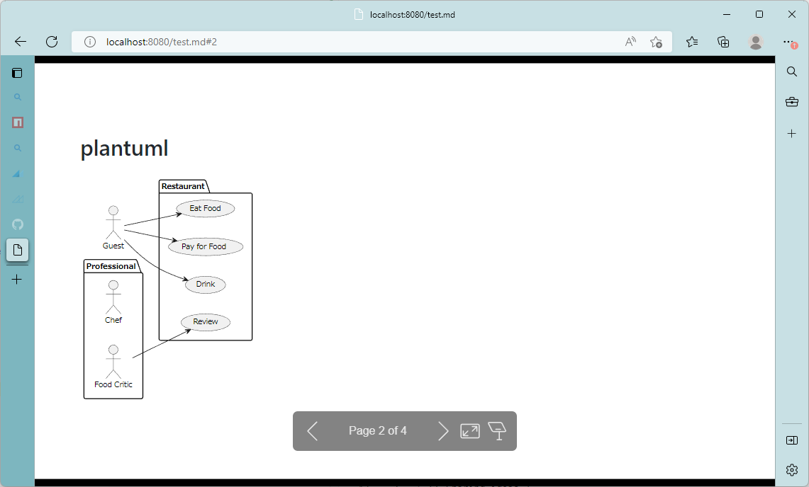

# markdown-it-kroki

This library is a pugin for markdown-it to create textual figure to svg (or png).

> Especialy, design for marpit !!

To use this package, You can write Programing Diagram (like uml) is written by **code** in Marp Slides-deck.

See sample code.

## Sample

    ---
    marp: true
    ---


    ## plantuml

    ```plantuml[platuml image]
    @startuml
    left to right direction
    actor Guest as g
    package Professional {
    actor Chef as c
    actor "Food Critic" as fc
    }
    package Restaurant {
    usecase "Eat Food" as UC1
    usecase "Pay for Food" as UC2
    usecase "Drink" as UC3
    usecase "Review" as UC4
    }
    fc --> UC4
    g --> UC1
    g --> UC2
    g --> UC3
    @enduml
    ```



If you want to write daigram, you write Diagram Language (like [plantuml](https://plantuml.com/), [mermaid.js](https://mermaid-js.github.io/mermaid/#/)) with in fenced code block.

## How to install

This project is `npm` package. 
So you can install `npm install` command like bellow.

```bash
npm install path/to/markdown-it-kroki
```

> I'm trying to register to npm registry, so just moment please.


## How to use

Here is the how to use `markdow-it-kroki`.
This section introduce how to create Marp slides-deck project,
and introduce how to create Marp slides-deck server.

You can find deltail info in [here](https://marp.app/),
and you can learn about marp plugin eco-system, [here](https://marpit.marp.app/usage?id=extend-marpit-by-plugins).

### Create Slides-deck project

First, for create slides-deck, you have to prepair to **Marp Project** directory.
So, Create slides-deck project, and init npm package.

```bash
mkdir myslides
cd myslides

npm init -y
```

And install [marp-cli](https://github.com/marp-team/marp-cli)

```bash
npm install -D @marp-team/marp-cli
```

> off-course you can install as **global package**, or run at-once like `npx`.

### Download this project and install

```bash
git clone https://github.com/kazumatu981/markdown-it-kroki.git

cd myslides
npm install -D path/to/markdown-it-kroki
```


### Create `marp.config.js`.

Here is the configuration file for **Marp**.

```javascript
module.exports = {
    inputDir: './slides',
    engine: ({ marp }) => marp.use(require('../index'), {
        entrypoint: "https://kroki.io",
        marpAutoScaling: true
    })
}
```

### Create your slides

On `slies` directory. you create slides-deck. like this.

    ---
    marp: true
    ---


    ## mermaid

    ```mermaid[mermaid image]
    flowchart TD
        Start --> Stop
    ```

### run server

Run marp server.

```bash
marp -s -c marp.config.js
```

## Detail

### Syntaz of Markdown

#### Diagram Language

You have to write diagram language by [fenced code block](https://spec.commonmark.org/0.30/#fenced-code-blocks) syntax start with **triple back quot** and language.

    ```plantuml

This package depen on kroki.io.
So if you want to know **support diagram language** is,
you will see in [https://kroki.io/](https://kroki.io/).

#### Alt Text

You can write Alt-text attribute to IMG tag in HTML.
Write in `square blacket` after **Diagram Language**.

    ```mermaid [check your network config..]

### Options of `constructor`

| property-name     | type      | mean                                                   | defaul value              |
| ----------------- | --------- | ------------------------------------------------------ | ------------------------- |
| `entrypoint`      | `string`  | The entry point for Kroki server.                      | `'https://kroki.io'`      |
| `marpAutoScaling` | `boolean` | Write marp-style `IMG`-tag, whether or not.            | `true`                    |
| `containerClass`  | `string`  | class name of container (`DIV`-tag `class` attribute). | `'kroki-image-container'` |
| `imageFormat`     | `string`  | image format of diagram. see [here](https://kroki.io/) | `'svg'`                   |
